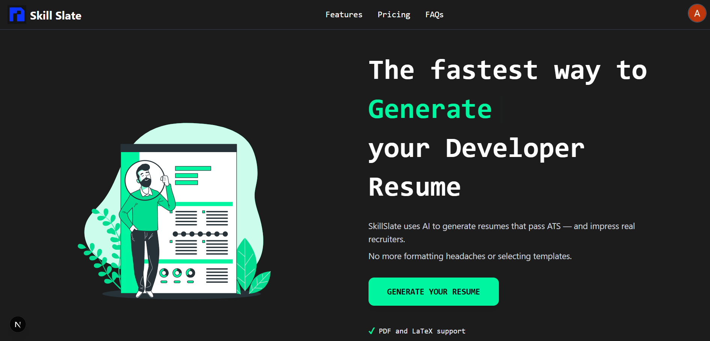
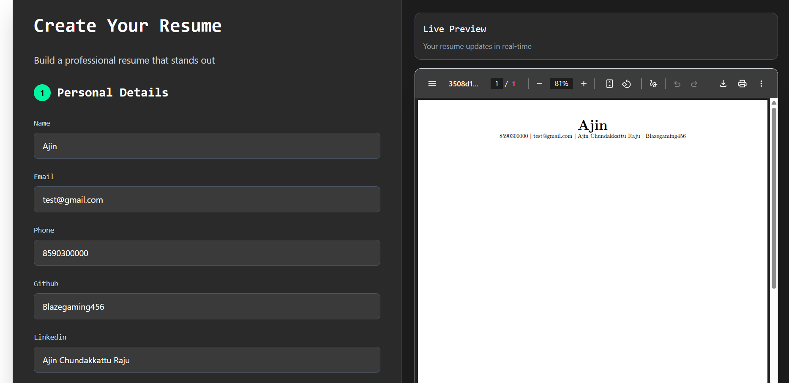
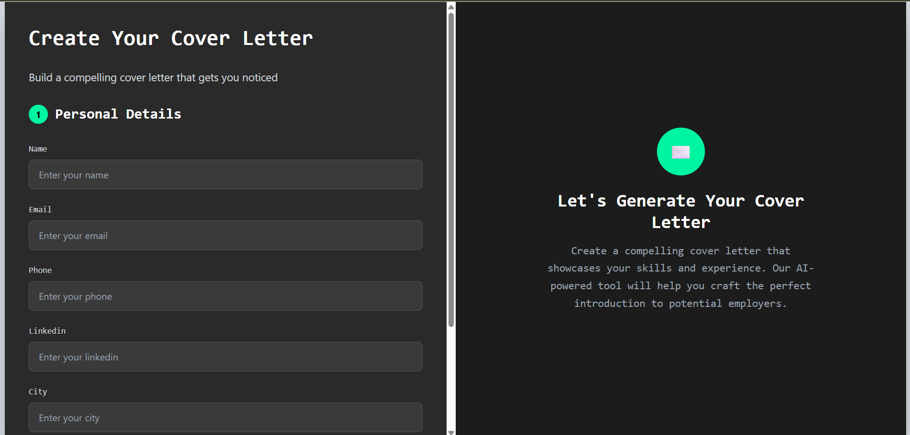
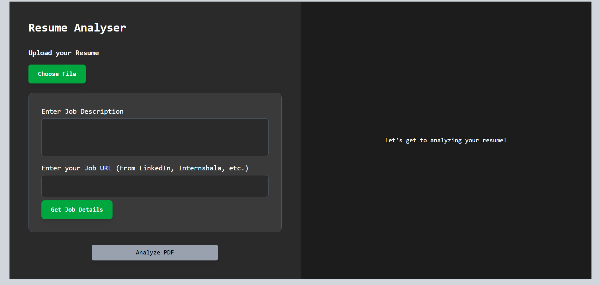
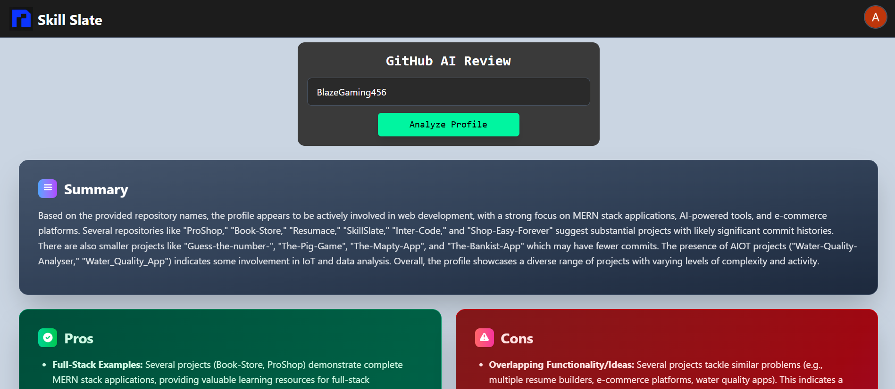
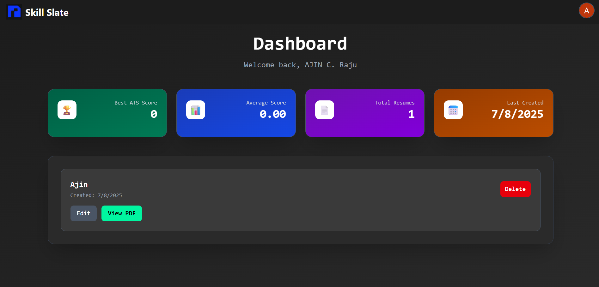

# Skill Slate

> **AI-powered Resume & Cover Letter Generator**  
> Built with Next.js, Tailwind CSS, Gemini API, pdf-parse, Prisma, and more.

You can visit the live page at https://skillslate.vercel.app/

You can see the video demo of the page at https://youtu.be/LKxXYOuIXr4

---

## Screenshots













---

## 🚀 Overview

Skill Slate is a modern, full-stack web application that empowers developers and tech professionals to generate, improve, and optimize their resumes and cover letters using advanced AI. The platform features a beautiful, responsive UI, ATS (Applicant Tracking System) analysis, job match scoring, and a suite of tools to help users stand out in the job market.

---

## ✨ Features

### 💻 Modern UI/UX

- Neon-accented landing page with animations
- Mobile-first, responsive design
- Dark theme with consistent branding

### 📄 Resume Generator

- Step-by-step form builder with live LaTeX PDF preview
- Export clean, ATS-friendly PDF resumes
- AI bullet point enhancement (Projects, Experience, etc.)

### ✍️ Cover Letter Generator

- Create job-specific cover letters with AI
- Preview and export LaTeX-based PDF

### 🧠 Resume Improvement & ATS Analysis

- Upload your resume to get AI suggestions
- ATS score + job match analysis (based on JD or scraped job link)
- Visual feedback cards

### 🔍 GitHub Profile Review

- Enter GitHub username for a smart review
- AI-generated summary, pros/cons, and improvement tips

### 📊 Dashboard & Analytics

- View, edit, and delete saved resumes
- Resume analytics (best/average ATS score, total created)

---

## 🗂️ Project Structure

- `app/` — Next.js app directory (pages, API routes, layout)
- `components/` — UI components (Navbar, Features, Info, ResumeForm, etc.)
- `prisma/` — Database schema (PostgreSQL, Prisma ORM)
- `public/` — Static assets (favicon, SVGs, images)
- `lib/` — Utility libraries (PDF parsing, DB)
- `test/` — Test data (sample PDFs)

---

## 🛠️ Tech Stack

- **Frontend:** Next.js (App Router), React, Tailwind CSS, Framer Motion
- **Backend:** Next.js API routes, Prisma, PostgreSQL, Gemini API, pdf-parse
- **Authentication:** NextAuth.js with Prisma adapter
- **AI Integration:** Gemini API for resume/cover letter generation and analysis
- **PDF/LaTeX:** pdf-parse, LaTeX export, PDF preview
- **Other:** Axios, Cheerio and Puppeteer (scraping), Multer (uploads), React Markdown

---

## 🧑‍💻 Challenges Faced

- **Latex Generation and Latex to PDF Generation**
  One of the main difficulties I faced was for the generation of the latex code as well as its conversion into PDF.
  It was difficult especially intially to generate the appropriate latex code, so that the form data is converted into a properly formatted PDF.
  To convert the latex code into PDF, I had started the project thinking of using free online compilers, however, half way through the project realized that they had a specific limit on the code allowed and would not be suitable for the project.
  This meant that I would have to create a suitabel latex compiler backend that was then deployed on Railway and used to generate the required resumes and cover letter in th eproject now.
  It was a great learning experience, and was very fruitful.

- **Prompt Engineering and AI Output:**  
  Crafting effective prompts for Gemini to generate high-quality, ATS-optimized, and visually consistent resume content.
  Especially in the case of improving specific points given by the user.

- **UI/UX Consistency & Browser Cachin Issues:**  
  Achieving a modern, visually appealing, and consistent design across all sections, including responsive layouts and animated elements.
  Also faced issues ensuring the favicon and static assets update correctly despite browser caching.

---

## 🏗️ Getting Started

1. **Install dependencies:**

   ```bash
   npm install
   # or
   yarn install
   ```

2. **Set up environment variables:**

   - Create a `.env` file with your database URL and any required API keys.

3. **Run the development server:**

   ```bash
   npm run dev
   # or
   yarn dev
   ```

4. **Open [http://localhost:3000](http://localhost:3000) in your browser.**

---

## 🧩 Key Pages & Features

- `/` — Landing page (Hero, Info, Features, FAQ, Pricing)
- `/generate/resume` — Resume generator (AI-powered)
- `/generate/cover-letter` — Cover letter generator
- `/improve` — Resume improvement & ATS/job match
- `/github` — GitHub profile AI review
- `/dashboard` — User dashboard & analytics

---

## 🗃️ Database Schema

Using Prisma with PostgreSQL.  
Example model:

```prisma
model Resume {
  id        String   @id @default(cuid())
  userId    String?
  name      String?
  latexCode String
  atsScore  Int?
  data      Json?
  createdAt DateTime @default(now())
}
```

---

_Skill Slate — The fastest way to generate, improve, and ace your developer resume, cover-letter and github profile!_